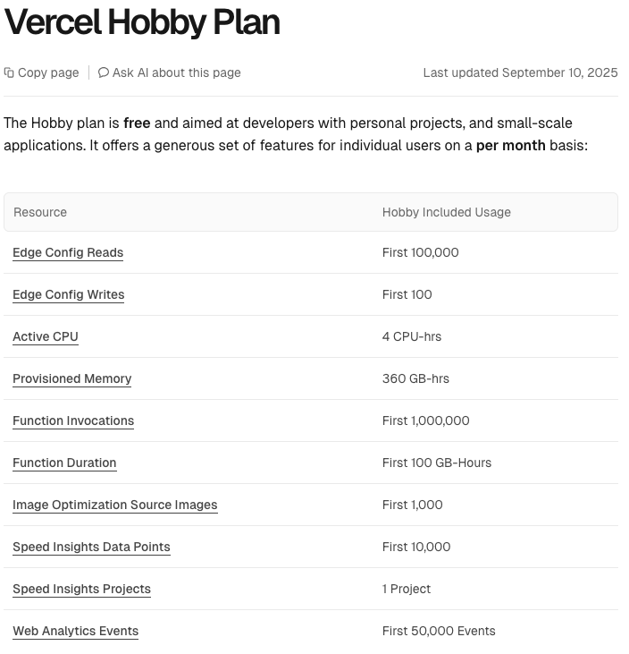

+++
date = '2025-11-23T22:51:44+09:00'
draft = false
title = 're:re:ブログ環境再構築'
author = ["@ttak0422"]
tags = ["tech", "hugo", "nix"]
categories = ["posts"]
+++
ブログ環境の構築は今回で3回目になる。

ニッチなモノの特殊な活用方法に関心がある人間にとって、手元の記録を公開する意義は薄かった。
技術的な面白さだけで駆動し続けることは難しかった。
[Org Mode](https://orgmode.org/ja/)や[Obsidian](https://obsidian.md/)といった個人最適化されたアウトライナー環境に定住してしまったのは必然だっただろう。
報酬系の設計ミスだった。

状況は変わる。AI時代になって自身の素朴なアウトプットの価値は上がった。
同時にBYODが禁止された環境で、そこにアクセスできない不都合が顕在化した。

幸い外部から内部に向けた通信は許可されているため、都度温かみのある手動送信で耐えていた。
本日をもって、それをゼロにする。

## 要求
1. 運用コストが限りなくゼロであること
2. 技術的に面白くないこと
3. 内容を都合の良いフォーマットとして取得できること

## 構成

労力と費用の両方を抑え省エネを実現したい。ホスティングには [Vercel](https://vercel.com/) を利用する。
エコシステムが成熟している。
収益化の予定もなく、個人用途なので [VercelHobby Plan](https://vercel.com/docs/plans/hobby) の枠内に収められるだろう。

サイトの構築には [Hugo](https://gohugo.io/) を利用する。
ここ最近、Hugoから [Astro](https://astro.build/) や [HonoのSSG Helper](https://hono.dev/docs/helpers/ssg) へ移行する記事を見かける。
唆られるものがあるが面白すぎる。欲しいのはBetter [Pandoc](https://pandoc.org/)であるため弱い択を取る。

## Hugo

Hugoの自由度の低さについてはよく指摘を見るが、コンテンツを複数形式で出力するシンプルな設計は気に入っている。
LLMの流行でMarkdownとしてコンテンツ取得できることの価値が上がったが、Hugoの仕組みで、ほぼゼロコストで対応が出来ている。

最近は[Issue 45 - Markdown is Holding You Back](https://newsletter.bphogan.com/archive/issue-45-markdown-is-holding-you-back/)といった声もある。
将来的に今のフォーマットが時代遅れになったとき、出力フォーマットを追加するか、コンテンツの出力方法を変えることになるだろう。
だがそれは今ではない。選択を先送りにできる技術が正義である。

## 所感
<!-- textlint-disable ja-technical-writing/ja-no-weak-phrase -->
UGC (User Generated Content) 環境に大量にAIが投入されるようになったとことで、
個々人の雑記が再評価されるようになったように思う。
<!-- textlint-enable ja-technical-writing/ja-no-weak-phrase -->
