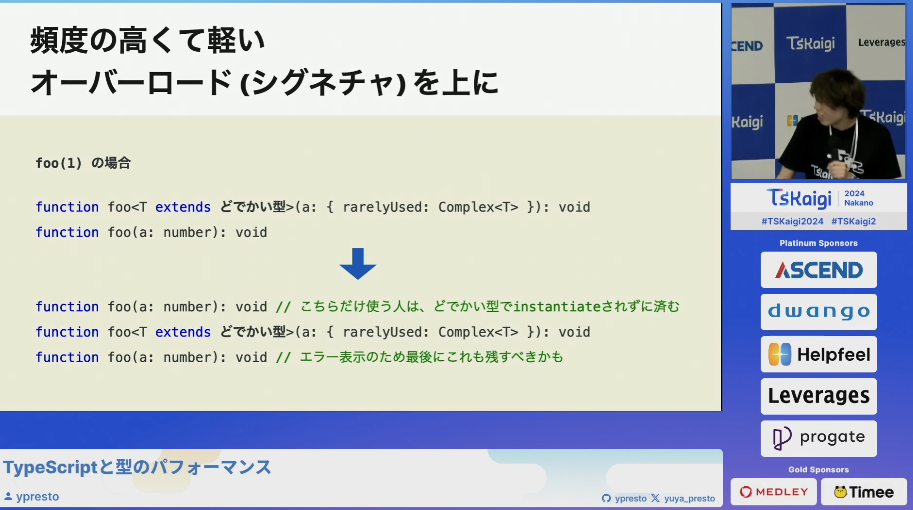
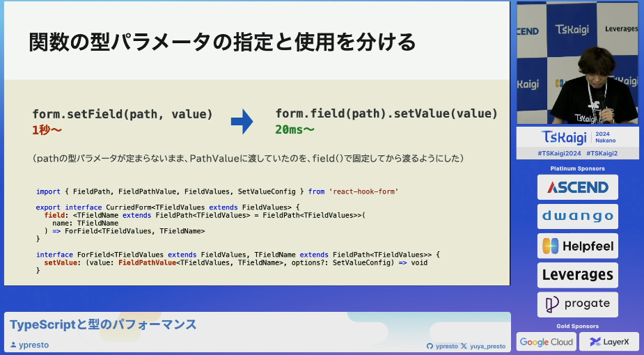
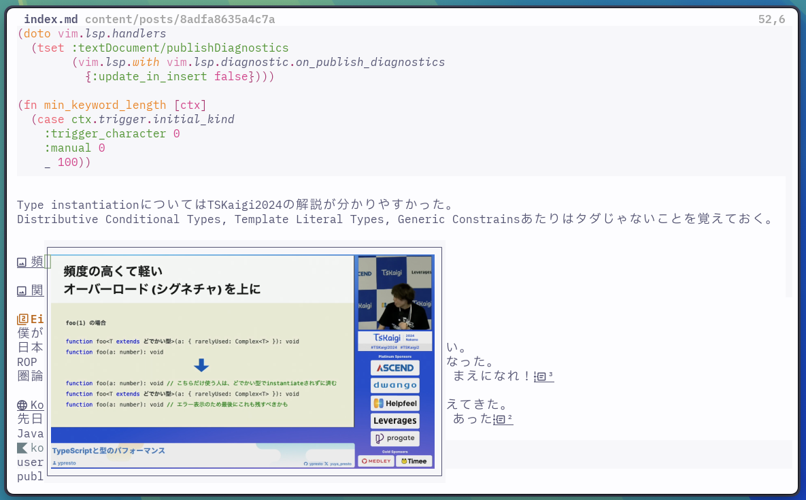

# 雑記
公開メモができた。最初なのでメモに関するメモが多い。

- [re:re:ブログ環境再構築]()
- [HugoにNixをひらく]()
- [最小Nix堅牢構成]()

# 技術メモ
後で時系列と合わせて参照できるように記録してみる。

##  [fix(types): correct types when middleware return Promise<void>](https://github.com/honojs/hono/pull/4529)

<blockquote class="twitter-tweet"><p lang="ja" dir="ltr">たぶん無理ゲーなんだけど、本当にhonoにコントリビュートしたいのならこれのパフォーマンス上げてほしい<br><br>つまり挙動はこれでいいんだけど、Instantiationsの増加がやばいので少なくしてほしい<br><br>まじで尊敬する<a href="https://t.co/8Wy9M5QBpg">https://t.co/8Wy9M5QBpg</a></p>&mdash; Yusuke Wada (@yusukebe) <a href="https://twitter.com/yusukebe/status/1993281113729724523?ref_src=twsrc%5Etfw">November 25, 2025</a></blockquote> <script async src="https://platform.twitter.com/widgets.js" charset="utf-8"></script>

詳しくないなりに難しいことをやっていると分かる。
Honoの実装は読んでみたい。型の天才達の叡智の結晶という感じがする。
重い言語サーバとの付き合い方はいろいろある。

insert modeでdiagnosticの発火を無効化にしたり、completionの発火をホワイトリスト的に制御するなどある[^1]。
[LSPの仕様](https://microsoft.github.io/language-server-protocol/specifications/lsp/3.17/specification/)は一度目を通しておくと面白い。
診断や補完ソースの制御は楽しい。

```fennel
;; lsp.fnl
(doto vim.lsp.handlers
  (tset :textDocument/publishDiagnostics
        (vim.lsp.with vim.lsp.diagnostic.on_publish_diagnostics
          {:update_in_insert false})))

(fn min_keyword_length [ctx]
  (case ctx.trigger.initial_kind
    :trigger_character 0
    :manual 0
    _ 100))
```

Type instantiationについてはTSKaigi2024の解説が分かりやすかった。
Distributive Conditional Types, Template Literal Types, Generic Constraintsあたりはタダじゃないことを覚えておく。
コンパイラの気持ちになろう。





## Either的な型
僕が愛するニッチな言語[F#](https://dotnet.microsoft.com/ja-jp/languages/fsharp)を用いた本が
日本語に訳されるなど最近Railway Oriented Programming(ROP)がアツい。
ROPの提唱者のScott Wlaschinが関数型まつりで[登壇](https://fortee.jp/2025fp-matsuri/proposal/view/cc680424-27f5-4fc1-8fa1-82b5df6cad20)するなど話題になった。
圏論は基礎教養になってきたと言える。lambda式みたくtraverseもあたりまえになっていくんじゃないだろうか[^2]。
[cats](https://github.com/typelevel/cats)から履修するのが良さそう。

[Kotlin](https://kotlinlang.org/)の関数型ライブラリである[Arrow](https://arrow-kt.io/)の導入事例を聞くことも増えてきた。
先日開催された[JJUG CCC 2025 Fall](https://jjug.doorkeeper.jp/events/190868)でも型安全の文脈でセッションがあった[^3]
Javaには無い拡張関数を使った軽量な記述は良さそうに思った。
```kotlin
user.right() // ← Right(user)になる
```
ライブラリが盛り上る中、言語レベルで[Rich Errors](https://github.com/Kotlin/KEEP/blob/main/proposals/KEEP-0441-rich-errors-motivation.md)というエラーハンドリング方法を設計しているらしい。

```kotlin
fun load(): User | NotFound

when (val user = load()) {
    is User -> println("Hello, ${user.name}")
    is NotFound -> println("Not found!")
}
```

## Kotlinに対する所感
回りにKotlin愛好家が増えて情報を追うようになった。Kotlinは実運用上、特定のIDEでしか動かないので嫌いだ。
ただ界隈には複雑な問題に取り組んでいそうな人が多く、良質なノウハウを共有していることが多いように感じた。

<iframe class="speakerdeck-iframe" style="border: 0px; background: rgba(0, 0, 0, 0.1) padding-box; margin: 0px; padding: 0px; border-radius: 6px; box-shadow: rgba(0, 0, 0, 0.2) 0px 5px 40px; width: 100%; height: auto; aspect-ratio: 560 / 315;" frameborder="0" src="https://speakerdeck.com/player/b231e2cba6c04cb38643d576ff98ea72" title="DDDにおける認可の扱いとKotlinにおける実装パターン / authorization-for-ddd-and-kotlin-implement-pattern" allowfullscreen="true" data-ratio="1.7777777777777777"></iframe>
<iframe class="speakerdeck-iframe" style="border: 0px; background: rgba(0, 0, 0, 0.1) padding-box; margin: 0px; padding: 0px; border-radius: 6px; box-shadow: rgba(0, 0, 0, 0.2) 0px 5px 40px; width: 100%; height: auto; aspect-ratio: 560 / 315;" frameborder="0" src="https://speakerdeck.com/player/6698e98165784506b9b9ad829d972b2d" title="Why Kotlin?  電子カルテを Kotlin で開発する理由 / Why Kotlin? at Henry" allowfullscreen="true" data-ratio="1.7777777777777777"></iframe>

## 関係無いけど面白かったスライド

<iframe class="speakerdeck-iframe" style="border: 0px; background: rgba(0, 0, 0, 0.1) padding-box; margin: 0px; padding: 0px; border-radius: 6px; box-shadow: rgba(0, 0, 0, 0.2) 0px 5px 40px; width: 100%; height: auto; aspect-ratio: 560 / 315;" frameborder="0" src="https://speakerdeck.com/player/5adc80628db1475bbcf3b4e745b84f89?slide=113" title="m3 ai team" allowfullscreen="true" data-ratio="1.7777777777777777"></iframe>

筋トレ問題、英会話問題、ホールケーキ問題。言語化の大切さは知られているが、命名が言語化のコアであろう。

## アーキテクチャ

### [Software Architecture Monday](https://www.developertoarchitect.com/lessons/)
Oreilly本で有名なアーキテクトが月一ペースで動画投稿するシリーズ。
コンパクトなボリュームなので1日一本見られそう。

### [アーキテクチャConference 2025](https://architecture-con.findy-tools.io/2025)関連の投稿
先日開催された関連の投稿を見た。
[永続化と切り離した＂純粋＂ドメインモデリング入門 - ステート、イベント、Deciderで始めるイミュータブルモデルの実装](https://zenn.dev/jtechjapan_pub/articles/fc9878ec69b6a1)


FP, DDDの文脈でイベントソーシングの話題で盛り上ることが増えてきた。
学習コストは安い買い物。AI時代になって難しいことの定義も変わった。
EasyよりSimpleというのは有名な話だが、専門性を要求する高度な制約を課すスタイルが刺さる。


## VimmerによるVimmer(になりたい人)のためのVim動画

IDE愛好家だった自分がVim墜ちしたのを思い出す名作だった。



僕をVim墜ちさせた動画。



# 今週のVim

正確な表現では無いが、開いているファイル一覧を気にすることが無くなった。
Bufferlineの代わりに[heirline.nvim](https://github.com/rebelot/heirline.nvim)を利用して
表示されているバッファについてだけWinbarで名前を表示するようにした。




[^1]: [blink-cmp](https://github.com/saghen/blink.cmp/blob/f13226770b4947eb7e66befbeb53c3db39f13e25/doc/blink-cmp.txt#L1119-L1122),[ddc-vim](https://github.com/Shougo/ddc.vim/blob/ef527ad60b199b11d022a648a24ab6d424227943/doc/ddc.txt#L754-L759)
[^2]: [map を使いこなせるあなたに traverse](https://zenn.dev/gakuzzzz/articles/81cd723a36067f)
[^3]: [エラー処理の選択肢を増やす try-catchから始めて段階的に型安全へ](https://www.docswell.com/s/yoheiyohei4/574888-expanding-your-error-handling-options)
