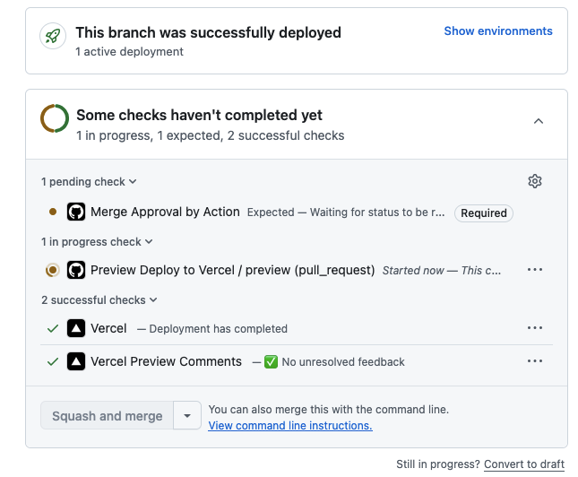
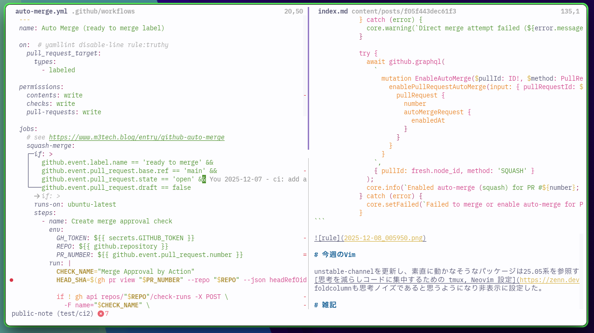
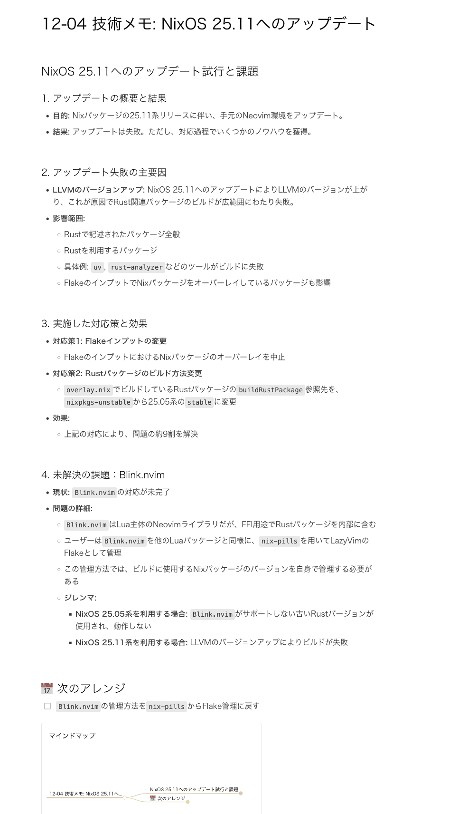

# 技術メモ

### [Nixpkgs 25.11 release](https://nixos.org/manual/nixpkgs/stable/release-notes#sec-nixpkgs-release-25.11)

半年に一度のお祭り。11/30に25.11がリリースされた。とりあえずNeovim環境の更新作業中。
Rustパッケージの利用が増えたのでLLVM更新の影響を受けるようになってしまった。

###  [【npm】11月21日以降にnpm installした人へ - Shai-Hulud感染チェック & 多層防御ガイド](https://zenn.dev/hand_dot/articles/04542a91bc432e)

[yarn](https://yarnpkg.com/)で困っていない・ノウハウを蓄積しているから惰性でyarnを使い続けていた。
[pnpm](https://pnpm.io/ja/)が提供してくれる`minimumReleaseAge`のようなオプションやライフサイクルスクリプトの制御は魅力的に思った。

### [Kawaiiパワーで完全に理解！しっかりやり切るOAuthとOIDC入門](https://zenn.dev/calloc134/books/sikkari-oauth-oidc/viewer/02-oauth-oidc-overview)
認可から認証に発展する流れを抑えておけば良さそう。知れば知るほど良く出来た仕組みだと関心する。

余談で触れられていたmTLSは最近良く聞くので調べておきたい。
> [信頼は相互に: Amazon CloudFront が mTLS をサポート](https://aws.amazon.com/jp/blogs/news/trust-goes-both-ways-amazon-cloudfront-now-supports-viewer-mtls/)

フローにおける主体客体問題は関心ごとを複雑にしてしまう。
物事を神視点で見るテクニックは非DDD領域にも適用できるように感じた。

### [GitHub のマージ方式を人間に毎回選ばせるのは、もうやめよう（やめた）](https://www.m3tech.blog/entry/github-auto-merge)

Squashマージは難しい。特にフローを設けている訳では無いがこのブログにも取り入れてみた。
GitHubをあまり触らないのでGitHubのブランチ保護ルールが変わったことを今知った。
Action内でcheckを作れることを知った。これを保護ルールに組込むことで手動マージできる経路を塞いだ。

```yaml
---
name: Auto Merge (ready to merge label)

on:  # yamllint disable-line rule:truthy
  pull_request_target:
    types:
      - labeled

permissions:
  contents: write
  checks: write
  pull-requests: write

jobs:
  # see https://www.m3tech.blog/entry/github-auto-merge
  squash-merge:
    if: >
      github.event.label.name == 'ready to merge' &&
      github.event.pull_request.base.ref == 'main' &&
      github.event.pull_request.state == 'open' &&
      github.event.pull_request.draft == false
    runs-on: ubuntu-latest
    steps:
      - name: Create merge approval check
        env:
          GH_TOKEN: ${{ secrets.GITHUB_TOKEN }}
          REPO: ${{ github.repository }}
          PR_NUMBER: ${{ github.event.pull_request.number }}
        run: |
          CHECK_NAME="Merge Approval by Action"
          HEAD_SHA=$(gh pr view "$PR_NUMBER" --repo "$REPO" --json headRefOid --jq '.headRefOid')

          if ! gh api repos/"$REPO"/check-runs -X POST \
            -F name="$CHECK_NAME" \
            -F head_sha="$HEAD_SHA" \
            -F status="completed" \
            -F conclusion="success" 2>&1; then
            echo "::error::Failed to create check run for PR approval"
            exit 1
          fi

          echo "✅ Created check run: $CHECK_NAME"

      - name: Squash-merge pull request
        uses: actions/github-script@v7
        with:
          github-token: ${{ secrets.GITHUB_TOKEN }}
          script: |
            const pr = context.payload.pull_request;
            const owner = context.repo.owner;
            const repo = context.repo.repo;
            const number = pr.number;

            const { data: fresh } = await github.rest.pulls.get({ owner, repo, pull_number: number });

            if (fresh.merged) {
              core.info(`PR #${number} is already merged.`);
              return;
            }

            try {
              await github.rest.pulls.merge({
                owner,
                repo,
                pull_number: number,
                merge_method: 'squash',
                commit_title: fresh.title,
              });
              core.info(`Squash merged PR #${number}.`);
              return;
            } catch (error) {
              core.warning(`Direct merge attempt failed (${error.message}). Trying to enable auto-merge instead.`);
            }

            try {
              await github.graphql(
                `
                  mutation EnableAutoMerge($pullId: ID!, $method: PullRequestMergeMethod!) {
                    enablePullRequestAutoMerge(input: { pullRequestId: $pullId, mergeMethod: $method }) {
                      pullRequest {
                        number
                        autoMergeRequest {
                          enabledAt
                        }
                      }
                    }
                  }
                `,
                { pullId: fresh.node_id, method: 'SQUASH' }
              );
              core.info(`Enabled auto-merge (squash) for PR #${number}; it will merge when branch protections pass.`);
            } catch (error) {
              core.setFailed(`Failed to merge or enable auto-merge for PR #${number}: ${error.message}`);
            }
```



<!-- textlint-disable ja-technical-writing/ja-no-weak-phrase -->
# 今週のVim

unstable-channelを更新し、素直に動かなそうなパッケージは25.05系を参照するように設定した。
[思考を減らしコードに集中するための tmux, Neovim 設定](https://zenn.dev/layerx/articles/8c29b0367238b8)を読んで
foldcolumnも思考ノイズであると考え非表示に設定した。



次回の大型更新に向けてflakeで管理するパッケージの大部分をnpinsに移行した 
([commit](https://github.com/ttak0422/dotfiles-nvim/commit/69e5be0d90c70e6eda1e14761b931472b0a0a335#diff-206b9ce276ab5971a2489d75eb1b12999d4bf3843b7988cbe8d687cfde61dea0))

# 雑記
Plaudを導入した。
ラバーダッキング相手としてはかなり優秀。画像はNeovimのNixpkgs更新が上手くいかなかったときのメモ。

<!-- textlint-enable ja-technical-writing/ja-no-weak-phrase -->
